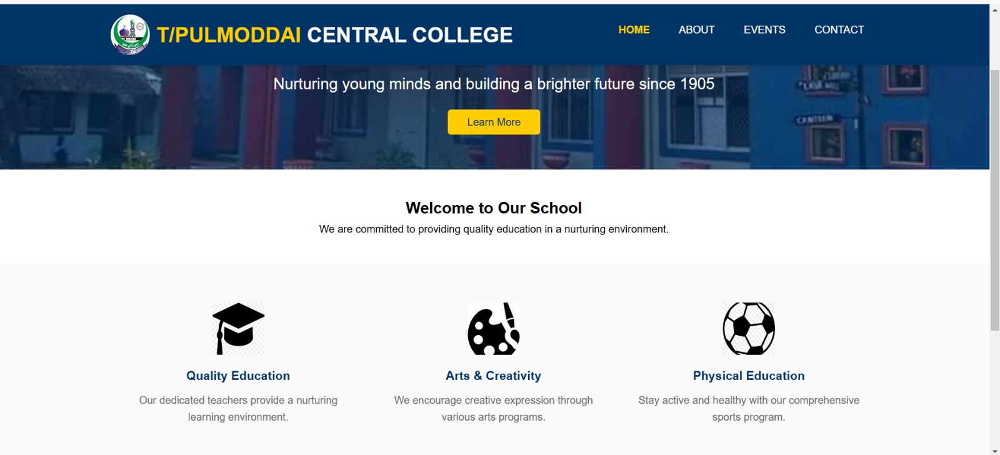
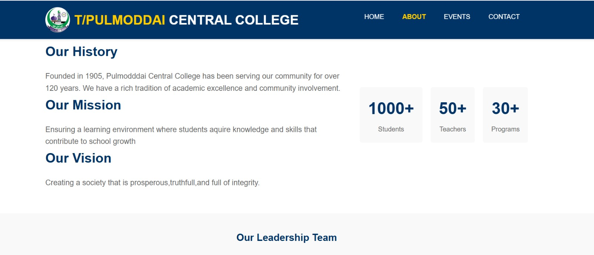

# 🌞 T/Pulmoddai Central College Website

Welcome to the **T/Pulmoddai Central College** website repository! This project is a fully responsive, multi-page website designed to showcase school information, events, and community connections. Built using **HTML** and **CSS**, it’s structured for simplicity, elegance, and easy navigation.

<p align="center">
  
</p>

---

## 📁 Project Structure

An overview of the project’s file structure keeps everything organized and accessible:

```
PMD_Central_college/
    ├── images/
    │   ├── logo.png
    │   ├── showcase.jpg
    │   ├── science-fair.jpg
    │   ├── sports-day.jpg
    │   ├── art-exhibition.jpg
    │   └── icons/
    │       ├── education-icon.png
    │       ├── arts-icon.png
    │       └── sports-icon.png
    ├── css/
    │   └── style.css
    ├── index.html
    ├── events.html
    ├── about.html
    └── contact.html
```

---

## 🌐 Live Demo

> **You can view a live demo** of the project by opening the `index.html` file in your preferred web browser.

---

## 🎨 Features

- **Responsive Design** 📱: Adapts smoothly to all device sizes, from desktops to mobile.
- **Event Showcase** 🎉: Highlight upcoming school events such as science fairs, sports days, and art exhibitions.
- **About Us** 📖: Learn about the school’s history, mission, and vision.
- **Contact Form** ✉️: Easily reachable with an interactive contact form and location map.

---

## 🖼️ Screenshots

| Home Page                                | About Page                                | Contact Page                              |
| ---------------------------------------- | ----------------------------------------- | ----------------------------------------- |
|         |        |        |

---

## 🚀 Getting Started

1. **Clone the Repository**  
   ```bash
   git clone https://github.com/arsath-eng/PMD_Central_college.git
   ```

2. **Navigate to the Project Directory**  
   ```bash
   cd PMD_Central_college
   ```

3. **Open the index.html**  
   Double-click on `index.html` or open it in your preferred web browser.

---

## 📂 Folder and File Details

- **index.html**: Home page of the website.
- **about.html**: Details about the school’s mission, vision, and history.
- **events.html**: A page dedicated to upcoming school events.
- **contact.html**: Contains a contact form and a Google Map integration.
- **css/style.css**: Contains all the styles and themes applied across the site.

---

## 🛠️ Technologies Used

- **HTML** - For structuring the content.
- **CSS** - For styling and layout.
- **Font Awesome** - For social media icons.

---

## 🌟 Contributions

Contributions, issues, and feature requests are welcome! Feel free to check the [issues page](https://github.com/arsath-eng/PMD_Central_college/issues) if you want to help out.

---

---

Enjoy exploring and improving the T/Pulmoddai Central College Website! 🚀
